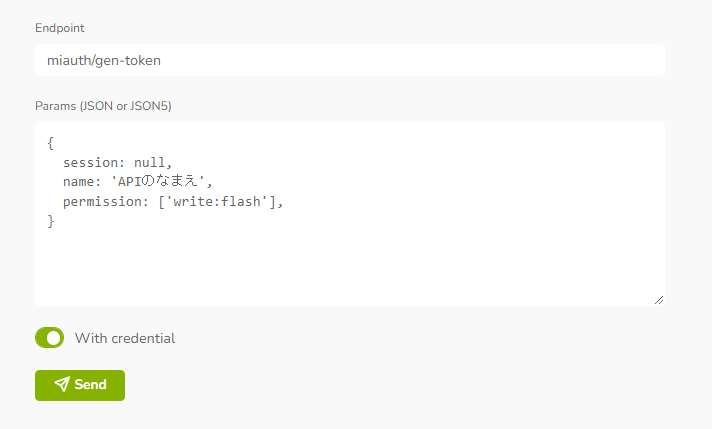

# Misskey Wordle

Implementation of Wordle in Misskey Play (auto-update system included)

Misskey Play での Wordle 風ゲームの実装（GASによる自動アップデートシステムつき）

# つかう

## クイックスタート

1. お使いのサーバーで、新しく Play を作成し、`index.is` の中身をコピーして貼り付けます
2. 手動更新を行う場合は、コード上部の `wordleData` を次の要領で書き換えます

```js
/** Wordleの情報（自動アップデート） */
let wordleData = {
    answer: "bleep", // 答え（英語・小文字・5文字）
    quizNo: 742, // クイズ番号
    date: "2023-07-01" // 日時（YYYY-MM-DD）
}
```

## Google Apps Script を使用した自動更新方法

このシステムでは、Google Apps Script を利用し、外部からスクリプト自体を書き換えることによって、Wordle 問題データの自動更新を実現しています。

3. Google Apps Script にて、単体の新規スクリプトを作成します
4. Misskey の **API Console よりトークン発行エンドポイントを直接呼び出し**、権限 `write:flash` を持つ API トークンを作成します  
   
5. `script.gs` をコピーし、貼り付けます
6. スクリプトを保存します
7. 「プロジェクトの設定」→「スクリプト プロパティ」と進み、以下の値をすべて設定します
    - `MISSKEY_TOKEN` … 手順4で作成したトークンを貼り付け
    - `MISSKEY_PLAY_ID` … Play の ID を貼り付け
    - `MISSKEY_DOMAIN` … サーバーのドメインを入力（ `https://` も含める）
8. スクリプトエディターに戻り、関数 `updateFlash` を実行します
9. 初回起動時は権限が求められますので、同意し許可します
10. Misskey Play に移動し、正しく更新されたか確認します  
    （デフォルトでは、説明文に更新日時が記載されます。サーバーの状況により、変更の反映まで時間がかかることがあります）
11. 「トリガー」に移動し、「トリガーを追加」から以下のような設定でトリガーを作成します
    - 実行する関数 … `fixedTimeExecution`
    - イベントのソース … `時間主導型`
    - 時間ベースのトリガーのタイプ … `分ベースのタイマー`
    - 時間の間隔 … `1分おき`

# License

Creative Commons Attribution-NonCommercial-ShareAlike 4.0 International Public License  
(CC-BY-NC-SA 4.0)

(c) Osaka Prefectural Tondabayashi Junior and Senior High School